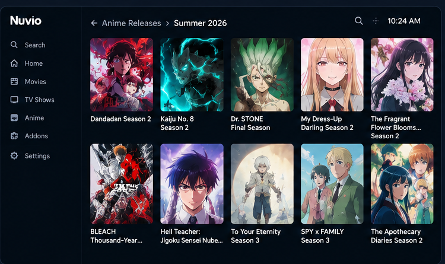
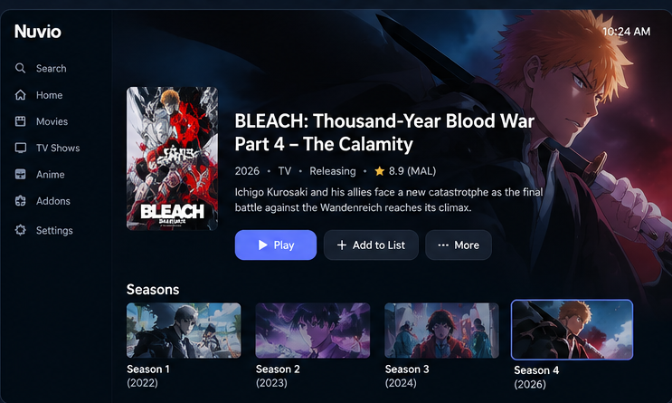

# Anime Releases for Nuvio

[](https://nuvio.tv)
[](https://myanimelist.net)
[](https://vercel.com)
[](https://github.com/mbmelgo/nuvio-anime-release-addon-v2/releases)

> A lightweight, season-aware anime release catalog for Nuvio and Stremio-compatible clients.

**Anime Releases for Nuvio** discovers anime releases from **AniList**, resolves each catalog item to a BingeCat-compatible identity through the ARM cross-provider mapping service, and delegates detailed metadata to the metadata addon configured in the client.

## ✨ Features

### 📺 Seasonal catalogs

The addon dynamically exposes:

- **Upcoming Season**
- **Current Season**
- **Previous Season**

The season windows are calculated from the current date rather than hard-coded to a particular year.

### ⏱️ Rolling release catalogs

Two rolling catalogs complement the seasonal views:

- **Upcoming — 5 days** — unique anime with an upcoming airing within the next five days.
- **Previous — 7 days** — unique anime with an airing within the previous seven days.

Rolling catalogs use AniList airing schedules, deduplicate by anime, and paginate the resulting unique catalog for Nuvio.

### 🔑 BingeCat-compatible catalog identity

Catalog items normally use one validated BingeCat-compatible identity:

```text
IMDb: tt<id>
TVDB: tvdb:<id>
TMDB: tmdb:<id>
```

The resolver prefers a validated IMDb candidate, then TVDB, then TMDB. ARM supplies the primary cross-provider mapping in a batched request. Later mapping sources supplement earlier candidates rather than being discarded when an earlier source returned only unsupported identities. ARM misses are retried through Fribb, AniList external provider links, AniMap, IDMapper, BingeCat exact search, the MAL-keyed Anime Mapper dataset, the AnimeAPI TSV dataset, IMDb title search, AnimeAPI by AniList ID, and, when the AniList entry exposes a MAL ID, the independent MAL identity bridge. Anime Mapper validates the requested AniList ID, can use direct TVDB/TMDB mappings, can use explicit episode TVDB show identities, and can follow explicit related-media mappings when the entry itself has no provider identity. AniList relation titles are also available to the BingeCat and IMDb fallbacks for sequel/spin-off entries whose provider uses the parent title. Relation provider links from explicit AniList relations are reused under the current AniList identity after provider validation. BingeCat title search also derives strictly validated File/Part/Episode installment variants. Rolling AniList schedules request the same relation provider links so rolling identity fallbacks remain consistent with seasonal catalogs. Related AniList identities can also be resolved through the same provider mapping sources when direct mapping is unavailable. Resolution first uses validated BingeCat-supported identities. After every legitimate provider mapping strategy is exhausted, the canonical AniList MAL ID is used as the final fallback (`mal:<id>`); no Japan/Korea or origin-based dropping rule is applied. If an entry has neither a validated provider identity nor a MAL ID, the catalog request fails explicitly rather than emitting an AniList ID.

The catalog keeps the AniList source id in the item's extra metadata so downstream systems can correlate the entry when needed.

### 📄 Nuvio pagination

- AniList seasonal pages use **50 items**, matching the Nuvio catalog page size.
- Rolling catalogs paginate **after** schedule records are filtered and deduplicated.
- Nuvio search parameters are supported by the catalog endpoints.

### 🎞️ Supported anime formats

Seasonal catalog discovery includes:

- TV
- TV Short
- ONA
- OVA
- Special
- Movie

Adult entries are excluded.

## 🖼️ What it looks like

The repository includes representative Nuvio-style screenshots for the addon views.

### Seasonal catalogs


### Season listing



### Rolling catalogs

#### Upcoming — 5 days


#### Previous — 7 days


The rolling views are intentionally shown separately so the upcoming and previous release sets are clear.

### Metadata detail flow



The production flow is:

```text
AniList release discovery
        ↓
validated BingeCat ID
        ↓
Nuvio catalog
        ↓
configured metadata addon
```

## 🧩 Architecture

```text
┌──────────────────────┐
│       AniList        │
│ release / airing data│
└──────────┬───────────┘
           │
           ▼
┌──────────────────────┐
│ Anime Releases       │
│      for Nuvio       │
│ BingeCat identities   │
└──────────┬───────────┘
           │
           ▼
┌──────────────────────┐
│        Nuvio         │
└──────────┬───────────┘
           │
           ▼
┌──────────────────────┐
│ Configured metadata  │
│       addon          │
└──────────────────────┘
```

This addon is intentionally **catalog-focused**. It does not duplicate detailed metadata, provider mapping, or playback resolution.

## 📦 Installation

### Production manifest

```text
https://nuvio-anime-release-addon-v2.vercel.app/manifest.json
```

Add the manifest URL to a supported Nuvio/Stremio client.

### Production landing page

```text
https://nuvio-anime-release-addon-v2.vercel.app/
```

The landing page provides the manifest, current catalog endpoints, release information, and representative screenshots.

## 📋 Production catalogs

| Catalog | Endpoint |
| --- | --- |
| Upcoming Season | `/catalog/anime/upcoming_season.json` |
| Current Season | `/catalog/anime/current_season.json` |
| Previous Season | `/catalog/anime/previous_season.json` |
| Upcoming — 5 days | `/catalog/anime/upcoming_5_days.json` |
| Previous — 7 days | `/catalog/anime/previous_7_days.json` |

Catalog names and season labels are generated dynamically.

## 🚀 Current release

**Production:** `v1.9.0`  
**Development:** `v1.9.0`  
**Major baseline:** `v1.0.0`

The 1.1.0 release carries the BingeCat identity-verification, cache-safety, related-title, numbered-installment, evidence-aggregation, and year-validation fixes validated on main.

The 1.2.0 corrective release refreshes cached negative BingeCat results during the authoritative verification pass so transient misses cannot mask a supported identity.

The 1.3.0 corrective release reduces redundant BingeCat searches for already-resolved identities, lowering upstream request pressure while retaining the authoritative verification pass.

The 1.4.0 corrective release adds transient BingeCat upstream retries so temporary 429/5xx/network failures do not become false identity-resolution misses.

The 1.4.0 corrective release retries transient BingeCat upstream failures before falling back, preserving supported identities during temporary upstream errors.

The 1.5.0 corrective release preserves every AniList catalog row through terminal identity fallback, requires direct BingeCat evidence for advertised provider identities, and hardens live catalog resolution against unresolved identities.
This release is the controlled production promotion of the tested identity-preservation and BingeCat-verification fixes.
Release target: `v1.5.0`.


The 1.0.0 release establishes the major baseline for the production-ready identity-resolution architecture, including provenance-aware validation, generalized weak-provider rejection, and the complete fallback chain.

This release is the controlled production baseline for continued P0 identity-resolution work.

The v2 project was initialized from an unreleased `v0.0.0` baseline. Version `1.0.0` is the first deliberate major release.

Production releases are published as Git tags and GitHub Releases.

A manual **dry run** validates CI, release metadata, the target version/SHA, and production behavior without deploying to Vercel, creating a tag or GitHub Release, or mutating release state.

**Releases:** https://github.com/mbmelgo/nuvio-anime-release-addon-v2/releases

Versioning:

- **PATCH** — meaningful development changes.
- **MINOR** — production deployments.
- **MAJOR** — deliberate project or architectural baseline changes, including the v1.0.0 production baseline.

## 🔧 Development

This is a small serverless JavaScript addon designed for Vercel.

### Requirements

- Node.js **20+**
- npm

### Run tests

```bash
npm test
```

### Project structure

```text
api/
  catalog-source.js
  home-selector.js
  resolver-manifest.js
  version.js

lib/
  catalog-anilist.js
  catalog-config.js
  catalog-meta.js
  catalog-pagination.js

scripts/
  release-target.mjs
  release-integrity.mjs
  validate-production.mjs

test/
  automated regression and release tests

ops/
  release-state.json

docs/images/
  representative Nuvio showcase images
```

## 🚦 Release pipeline

Production releases follow:

```text
Feature / change
  ↓
PR CI
  ↓
Merge to main
  ↓
Main CI + patch versioning
  ↓
Explicit release authorization
  ↓
Release/version integrity validation
  ↓
Controlled Vercel deployment
  ↓
Production validation: manifest + all 5 catalogs + metadata boundary
  ↓
Annotated Git tag + GitHub Release
  ↓
Release-state update
```

Release metadata is validated across `api/version.js`, `package.json`, `README.md`, and `ops/release-state.json`. Production validation checks all five supported catalogs for valid, unique Nuvio series identities and catalog-specific rolling metadata.

## 📄 Scope

This addon is responsible for:

- seasonal anime release discovery
- rolling upcoming/recent airing discovery
- BingeCat-compatible catalog identities with ARM-backed and secondary cross-provider mapping
- Nuvio-compatible catalog pagination
- catalog search
- dynamic seasonal organization

It is **not** a replacement for a detailed anime metadata/provider addon.

## 📜 License

This project is licensed under the MIT License. See [LICENSE](LICENSE) for the full license text.
